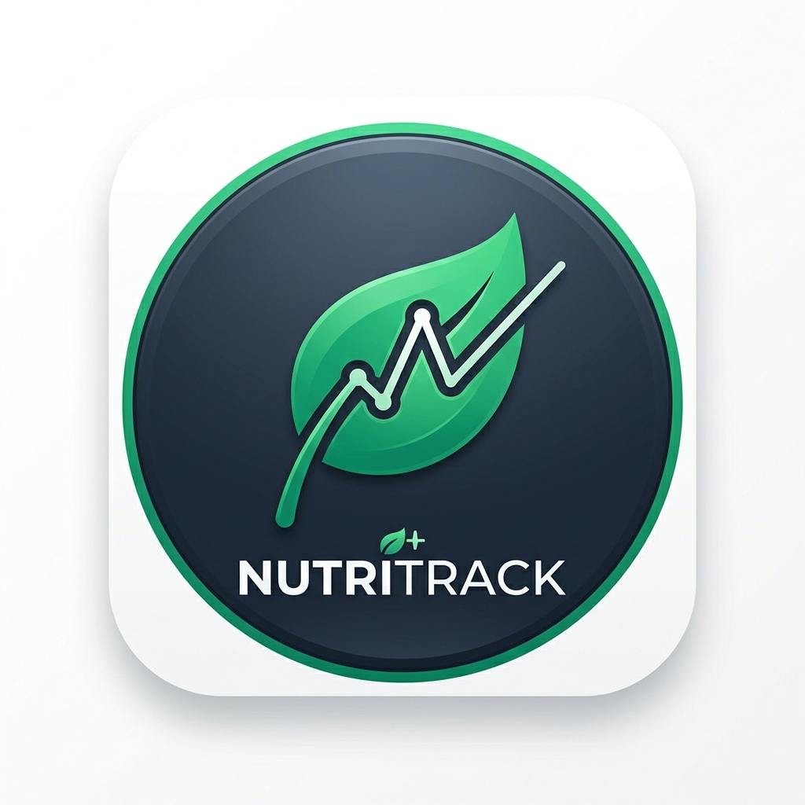

<div align="center">
  

  # 🥗 NutriTrack

  ### Your journey to a healthier life, simplified.

  [](https://reactnative.dev/)
  [](https://expo.dev/)
  [](https://www.nativewind.dev/)
  [](https://www.typescriptlang.org/)
  [](https://coderabbit.ai/)

  ---

  This screen was developed for a **technical test**.

  **NutriTrack** is a modern mobile application focused on nutritional management and health monitoring.

</div>

## 🛠️ Technologies Used

This project utilizes the latest technologies in the mobile ecosystem:

*   **[React Native](https://reactnative.dev/)**: The foundation of the project for native performance.
*   **[Expo](https://expo.dev/)**: A robust framework for simplified development and deployment.
*   **[NativeWind](https://www.nativewind.dev/)**: Tailwind CSS implementation for React Native, enabling fast and responsive styling.
*   **[React 19](https://react.dev/)**: Leveraging the latest library features for state management and performance.
*   **[TypeScript](https://www.typescriptlang.org/)**: Static typing for a safer and more maintainable codebase.

## 🤖 AI-Assisted Development

This project integrates **[CodeRabbit](https://coderabbit.ai/)** into its CI/CD workflow.
CodeRabbit acts as an intelligent code reviewer, providing feedback and suggesting improvements in Pull Requests, ensuring code quality and architectural standards are maintained at every stage of development.

## 🚀 How to Get Started

### Prerequisites
- Node.js installed
- Expo Go app installed on your smartphone or a configured emulator

### Installation

1.  Clone the repository:
    ```bash
    git clone https://github.com/JoaoPedroOM/NutriTrack.git
    ```
2.  Install the dependencies:
    ```bash
    npm install
    ```
3.  Start the development server:
    ```bash
    npx expo start
    ```

Scan the generated QR Code with the **Expo Go** app (Android/iOS) to see the app in action!

---

<div align="center">
  Developed with ❤️ by <b>João Pedro</b>
</div>
